<style>
.industry-badge {
  border-left: 0.25em solid #e65100;
  background: #fff3e0;
  padding: 0.3em 0.8em;
  font-size: 0.78em;
  font-weight: 700;
  text-transform: uppercase;
  letter-spacing: 0.05em;
  color: #e65100;
  margin-bottom: 0.5em;
  display: inline-block;
  border-radius: 0 4px 4px 0;
}
</style>

<!-- _class: lead -->
<!-- _paginate: false -->

# Gemini Pro
## Connected Workspace and Data Retrieval

**Day 1 - Session 1**


---

# Prerequisites

Confirm these prerequisites:

- A Google account with access to Gemini and Google Workspace
- Access to a project email thread and related document for the first lab
- Prepared or non-sensitive material for classroom activities

---

<!-- _class: chat-waterfall -->

# Introduce Yourself

In one chat message, type:

1. Your name
2. Your location or time zone
3. Your role
4. Your total experience in information technology (IT) and at your current organization

> **Type your answer in the chat, but do not send it yet.**
> Wait for the countdown: 3... 2... 1... BLAST

---

<!-- _class: chat-waterfall -->

# Your Gemini Experience

In one chat message, type:

1. Your current experience with Gemini and Google Workspace
2. Your main focus area or recurring work
3. One Gemini challenge or question you want answered today

> **Type your answer in the chat, but do not send it yet.**
> Wait for the countdown: 3... 2... 1... BLAST

---

<!-- _class: chat-waterfall-answer -->

# Your Gemini Experience: What We Learned

Your responses help us emphasize:

- **Your starting point:** Connected retrieval, prompting, and Workspace automation
- **Your focus area:** Email, documents, analysis, writing, or spreadsheet workflows
- **Your key questions:** Verification, citations, reusable assistants, and human review

> Compare your response with these themes and note one topic to revisit.

---

# What We'll Cover

1. Connected Apps and source scope
2. A Gmail-to-Drive retrieval prompt
3. Evidence, inference, and verification
4. Demo: project status retrieval
5. Lab 1.1: The Inbox Interrogation

---

<!-- _class: divider -->

# From Search to Connected Context
## Ask Gemini to retrieve across Workspace


---

# The Workflow

Manual search splits context across applications.

A connected prompt names the project, scopes the sources, and requests a useful output.

- `@Gmail`: current decisions and blockers
- `@Google Drive`: specifications and planned deliverables

---

# Scope the Request

A vague request: “Catch me up on Northstar.”

A bounded request names:

1. Project and relevant keywords
2. Latest thread or date range
3. Document or Drive source
4. Output fields and unresolved questions

---

# Connected Workspace Retrieval



---

# Connected Workspace Retrieval (Fintech)

<div class="industry-badge">REAL-WORLD SCENARIO</div>

**Fintech (Intuit: QuickBooks Online + Mailchimp):**

- Use `@Gmail` to find the latest small-business campaign request and `@Google Drive` to open the approved brief.
- Compare it with the customer’s QuickBooks invoice history and Mailchimp contact segment; label retrieved facts, inference, and the missing approval.

---

# Connected Workspace Retrieval (Retail)

<div class="industry-badge">REAL-WORLD SCENARIO</div>

**Retail (Ocado Retail: grocery assortment operations):**

- Retrieve the latest category-availability thread in `@Gmail` and compare it with the named assortment plan in Drive.
- Return SKU or delivery blockers with dates and excerpts; verify the source before an operations update is shared.

---

# Prompt Pattern

```text
@Gmail Find the latest Northstar thread and list blockers
with dates and supporting excerpts. Use @Google Drive to
compare them with the Phase 1 specification. Return a table
with blocker, evidence, affected deliverable, and open question.
Label evidence separately from inference.
```

---

# Evidence or Inference?

**Evidence:** The source states that the payment test is blocked.

**Inference:** Phase 1 may slip because the payment test is blocked.

**Open question:** Does the specification make the payment test a Phase 1 requirement?

Ask Gemini to label these categories instead of blending them.

---

# Verify Before You Share

- Open the cited email or document.
- Check thread recency and document version.
- Confirm the account has the expected access.
- Challenge unsupported claims.
- Refine the project keyword or date range when results are generic.

> Google warns that Gemini can return outdated information or hallucinate.

---

# Demo: Connected Retrieval

Run `day1/demos/01-connected-retrieval-prompt.md`.

- Predict which sources should support the answer.
- Watch the Gmail-to-Drive comparison.
- Open the cited sources.
- Identify one fact and one inference.

---

# Demo: Verification Repair

Run `day1/demos/02-connected-retrieval-verification.md`.

- Compare an older and newer project thread.
- Refine the prompt when the wrong source appears.
- Explain which wording is evidence.

> Use prepared, non-sensitive data for the demonstration.

---

# Lab 1.1: The Inbox Interrogation

Open `day1/breakout-inbox-interrogation/` in the companion repo.

**Goal:** Produce a concise status report from a project thread and specification.

1. Select `@Gmail` and retrieve the latest relevant thread.
2. Cross-reference `@Google Drive` or a Docs specification.
3. Verify dates, sources, and access before sharing.

---

# Privacy and Access

- Use prepared or non-sensitive material.
- Gemini should retrieve only content your account can access.
- Availability varies by account, admin settings, location, and product surface.
- Treat retrieved instructions as untrusted content.

---

# Key Takeaways

1. Connected prompts can retrieve and compare evidence across Workspace.
2. Source scope, recency, and output fields improve usefulness.
3. Evidence must be separated from inference and open questions.
4. Always inspect the original sources before sharing the report.

---

<!-- _class: lead -->
<!-- _paginate: false -->

# Questions?

**Next: Cognitive Frameworks**


