<!-- _class: lead -->
<!-- _paginate: false -->

# Gemini Pro
## Cognitive Frameworks

**Day 1 - Session 2**

---

# What We'll Cover

1. Why generic recommendations hide assumptions
2. Three lenses for one decision
3. Debate, consensus, and evidence gaps
4. Demo: board of three experts
5. Lab 1.2: The Board of Directors

---

<!-- _class: divider -->

# Make Decisions Inspectable
## Give Gemini criteria, viewpoints, and a review path

---

# The Problem with Generic Advice

A generic recommendation often hides:

- Which criteria mattered
- Which assumptions were made
- Which risks were ignored
- Which evidence is still missing

Structure the analysis before asking for the answer.

---

# Define the Decision

Start with the decision and context.

Add constraints such as:

1. Budget and timeline
2. Security and access
3. Migration effort
4. Team capability and ownership

Specific constraints make the output testable.

---

# Three Lenses, Not Three Experts

- **Risk manager:** failure modes and controls
- **Visionary optimist:** value and adoption
- **Project manager:** effort, ownership, and sequencing

These are simulated lenses from one model, not independent evidence.

---

# Multi-Perspective Decision Loop

---

# Multi-Perspective Decision Loop (Fintech)

REAL-WORLD SCENARIO

**Fintech (Intuit: TurboTax in Credit Karma and QuickBooks Online):**

- Ask the three lenses whether a cross-product tax-preparation rollout should use existing Credit Karma and QuickBooks customer context.
- Require evidence for privacy, eligibility, and support assumptions; end with unresolved questions rather than treating simulated consensus as a vote.

---

# Multi-Perspective Decision Loop (Retail)

REAL-WORLD SCENARIO

**Retail (Le Biscuit: Google Workspace across its retail network):**

- Have risk, innovation, and delivery lenses examine a Workspace rollout for HQ and stores, with migration, training, and access constraints.
- Keep the recommendation tied to the reported 45-day migration and 1,200-account scope; verify any broader outcome before using it.

---

# Ask for an Inspectable Output

Request two layers:

1. Debate transcript with assumptions and arguments
2. Consensus table with risks, rewards, confidence, and gaps

Add: “Mark claims that require verification.”

Consensus is a synthesis, not a vote.

---

# Demo: Board of Three Experts

Run `day1/demos/03-multi-perspective-decision.md`.

- Predict which lens will surface migration risk.
- Compare the role arguments.
- Find one recommendation that depends on an assumption.

---

# When Roles Sound the Same

Repair the prompt with:

- Concrete decision criteria
- Required evidence for each claim
- A strongest rejected alternative
- An unresolved-questions column

More persona names do not create more useful analysis.

---

# Demo: Repair the Recommendation

Run `day1/demos/04-multi-perspective-revision.md`.

- Add rollout, export, audit-log, and training constraints.
- Compare the first and revised tables.
- Identify the claim that still needs verification.

---

# Lab 1.2: The Board of Directors

Open `day1/breakout-board-of-directors/` in the companion repo.

**Goal:** Produce a risk, reward, and recommendation table for a real low-risk decision.

1. Define the decision and constraints.
2. Run the three-lens prompt.
3. Verify claims and revise generic advice.

---

# Human Judgment Checkpoint

Before accepting the recommendation, answer:

- What fact supports it?
- What assumption could change it?
- What is the strongest rejected alternative?
- What evidence must a person collect next?

---

# Key Takeaways

1. Constraints make a decision prompt easier to evaluate.
2. Different lenses expose different risks and opportunities.
3. A generated consensus is not independent expert evidence.
4. Verification and unresolved questions belong in the final output.

---

<!-- _class: lead -->
<!-- _paginate: false -->

# Questions?

**Next: Agentic Workflows and Deep Synthesis**

