<style>
.industry-badge {
  border-left: 0.25em solid #e65100;
  background: #fff3e0;
  padding: 0.3em 0.8em;
  font-size: 0.78em;
  font-weight: 700;
  text-transform: uppercase;
  letter-spacing: 0.05em;
  color: #e65100;
  margin-bottom: 0.5em;
  display: inline-block;
  border-radius: 0 4px 4px 0;
}
</style>

<!-- _class: lead -->
<!-- _paginate: false -->

# Gemini Pro
## Agentic Workflows and Deep Synthesis

**Day 1 - Session 3**


---

# What We'll Cover

1. Multi-step document workflows
2. Extracting claims instead of summarizing
3. Page references and methodology questions
4. Demo: PDF extraction and review
5. Lab 1.3: The Data Miner

---

<!-- _class: divider -->

# From Document to Evidence
## Make a long report reviewable one claim at a time


---

# What Makes a Workflow Agentic?

A substantial task becomes a sequence of operations:

1. Read the source.
2. Extract the requested evidence.
3. Organize findings into a schema.
4. Critique and verify the result.

Keep the intermediate evidence visible.

---

# Extract, Do Not Summarize

A summary is useful for orientation but hides individual claims.

Ask for one row per statistical claim:

- Claim copied exactly
- Page number
- Surrounding context
- Population or denominator
- Methodology question

---

# PDF to Cited Sheet



---

# Cited Evidence Extraction (Fintech)

<div class="industry-badge">REAL-WORLD SCENARIO</div>

**Fintech (Intuit: QuickBooks Online financial review):**

- Upload a prepared QuickBooks Online profit-and-loss report and extract each statistic into Claim, period, page, denominator, and methodology-question fields.
- Sample the PDF before exporting to Sheets; a cited row is a candidate finding, not financial advice or an approved business conclusion.

---

# Cited Evidence Extraction (Retail)

<div class="industry-badge">REAL-WORLD SCENARIO</div>

**Retail (Wayfair: Gemini-assisted catalog enrichment):**

- Extract product attributes and the supporting page or supplier reference from a prepared catalog report, one claim per row.
- Compare sampled rows with the source before a Sheets handoff; Wayfair reports catalog work across more than 30 million products, not a guaranteed classroom result.

---

# Make Claims Verifiable

```text
Do not summarize. Extract every statistical claim into one row.
Include Claim, Page Number, Surrounding Context, Population or
Denominator, and Methodology Question. Copy numbers exactly.
Mark ambiguous values or page references as unresolved.
```

---

# Sample the Source

Before exporting, inspect several rows against the PDF:

- Number, unit, and denominator
- Date and population
- Chart labels and footnotes
- Page reference and surrounding context
- Duplicate or conflicting claims

A candidate table is not verified evidence.

---

# Demo: Statistical Extraction

Run `day1/demos/05-pdf-statistical-extraction.md`.

- Predict which fields make a claim auditable.
- Compare extracted rows with source pages.
- Find one chart or footnote needing review.

---

# Export Is a Handoff

Google Sheets makes findings reusable, but export does not validate them.

Review:

- Headers and row completeness
- Numeric formats and units
- Duplicate claims
- Page references and review flags

---

# Demo: Review Before Export

Run `day1/demos/06-pdf-export-review.md`.

- Flag missing, duplicate, or ambiguous rows.
- Compare a flag with the original page.
- Export only the reviewed table.

---

# Lab 1.3: The Data Miner

Open `day1/breakout-data-miner/` in the companion repo.

**Goal:** Create a cited Sheets table of statistical claims from a prepared report.

1. Upload the report and run the extraction prompt.
2. Sample the page references and correct weak rows.
3. Export the reviewed table to Sheets.

---

# Current Industry Direction

Deep Research previews show a broader move toward planning, iterative search, and cited synthesis.

The transferable practice is simple:

- Make operations visible.
- Keep source references.
- Review before the result becomes an operational artifact.

---

# Key Takeaways

1. Agentic workflows sequence reading, extraction, organization, and review.
2. Structured fields preserve evidence that summaries often omit.
3. Page references and source sampling expose extraction errors.
4. Export to Sheets is a handoff after validation, not validation itself.

---

<!-- _class: lead -->
<!-- _paginate: false -->

# Questions?

**Next: Multimodal Analysis**


