<!-- _class: lead -->
<!-- _paginate: false -->

# Gemini Pro
## Multimodal Analysis

**Day 1 - Session 4**

---

# What We'll Cover

1. Video analysis with timestamps
2. Screenshot and flowchart analysis
3. Observation versus interpretation
4. Demo: video and UI critique
5. Lab 1.4: The X-Ray Vision Test

---

<!-- _class: divider -->

# See More Than Text
## Analyze audio, visuals, interfaces, and flows

---

# Multimodal Prompting

A useful prompt specifies:

- Media scope
- Analytical lens
- Output fields
- Uncertainty and verification rule

The model can inspect more than text, but it can still misread what it sees or hears.

---

# Video: Ask for Time

Request three counter-intuitive points with:

1. Exact `MM:SS` timestamp
2. Speaker’s supporting argument
3. Credible detractor’s response
4. A flag for approximate or unsupported claims

Replay the cited time before sharing the note.

---

# Screenshot: Describe Before Judging

First identify visible controls, labels, arrows, and states.

Then:

- Map the flow step by step.
- Name two possible friction points.
- Cite the visible evidence.
- Mark unreadable text as unknown.

---

# Multimodal Analysis Loop

---

# Multimodal Flow Analysis (Fintech)

REAL-WORLD SCENARIO

**Fintech (Intuit: TurboTax and Credit Karma):**

- Upload a cropped, non-sensitive TurboTax-in-Credit-Karma flow screenshot and ask Gemini to name visible fields, map the steps, and flag two friction hypotheses.
- Separate visible controls from interpretation; do not infer eligibility, refund results, or other sensitive financial facts from the image.

---

# Multimodal Flow Analysis (Retail)

REAL-WORLD SCENARIO

**Retail (THE ICONIC: Snap-to-Shop and Complete the Look):**

- Analyze a prepared screenshot of THE ICONIC’s visual discovery flow: list visible controls, map image-to-product steps, and mark unreadable labels unknown.
- Treat Snap-to-Shop and “Complete the Look” as named product concepts; replay or inspect the original source before claiming usability impact.

---

# Observation or Interpretation?

**Observation:** The Save control appears after a long form.

**Interpretation:** Users may miss Save because it is far below the fields.

The first is visible in the image. The second is a hypothesis that needs usability evidence.

---

# Demo: Timestamped Video Analysis

Run `day1/demos/07-youtube-timestamp-analysis.md`.

- Predict one important timestamp.
- Compare each timestamp with the original video.
- Mark an approximate claim as uncertain.

> Use a public, non-sensitive video.

---

# Demo: Screenshot Flow Critique

Run `day1/demos/08-screenshot-flow-critique.md`.

- Name visible controls before analysis.
- Compare the generated flow with the image.
- Separate evidence from a friction hypothesis.

---

# Lab 1.4: The X-Ray Vision Test

Open `day1/breakout-xray-vision/` in the companion repo.

**Goal:** Produce verified timestamped notes and a visual flow critique.

1. Analyze a long public video.
2. Verify timestamps and arguments.
3. Analyze a cropped screenshot or flowchart.

---

# Privacy and Accuracy

- Use public or prepared media.
- Crop credentials, customer data, and personal details.
- Fast motion and small text can be missed.
- Do not infer sensitive traits from images.
- Verify the original media before sharing.

---

# Key Takeaways

1. Multimodal prompts should define the media, lens, output, and uncertainty rule.
2. Timestamps are useful pointers that require replay verification.
3. Visual critique must separate visible evidence from friction hypotheses.
4. Public or prepared media keeps classroom analysis safer.

---

<!-- _class: lead -->
<!-- _paginate: false -->

# Questions?

**Next: Persistent Personas**

