<style>
.industry-badge {
  border-left: 0.25em solid #e65100;
  background: #fff3e0;
  padding: 0.3em 0.8em;
  font-size: 0.78em;
  font-weight: 700;
  text-transform: uppercase;
  letter-spacing: 0.05em;
  color: #e65100;
  margin-bottom: 0.5em;
  display: inline-block;
  border-radius: 0 4px 4px 0;
}
</style>

<!-- _class: lead -->
<!-- _paginate: false -->

# Gemini Pro
## Persistent Personas

**Day 1 - Session 5**


---

# What We'll Cover

1. What Gems save and reuse
2. The Relentless Editor contract
3. Testing a Gem with varied drafts
4. Demo: selective Canvas editing
5. Lab 1.5: Building the Coach

---

<!-- _class: divider -->

# Stop Starting from Blank
## Save the instructions for a recurring task


---

# What a Gem Contains

A useful Gem defines:

- Persona and role
- Recurring task
- Relevant context
- Response format
- Boundaries and missing-context behavior

A Gem is an instruction contract, not an independent expert.

---

# The Relentless Editor

```text
Identify clichés, logical gaps, unsupported claims, and
questions a reader may ask. Ask direct questions instead of
rewriting. Use a concise, no-nonsense tone. Preserve audience
and meaning. Ask before judging when context is missing.
```

Preview with a draft before clicking Save.

---

# Gem and Canvas Refinement



---

# Persistent Persona Review (Fintech)

<div class="industry-badge">REAL-WORLD SCENARIO</div>

**Fintech (Intuit: QuickBooks + Mailchimp):**

- Build a Gem that checks Mailchimp copy against a supplied QuickBooks customer segment or invoice context for clarity, unsupported claims, and missing approval.
- Refine one paragraph in Canvas without inventing financial facts; the QuickBooks–Mailchimp integration supports purchase and invoice history in contact profiles, but a writer approves the message.

---

# Persistent Persona Review (Retail)

<div class="industry-badge">REAL-WORLD SCENARIO</div>

**Retail (Wayfair: product catalog enrichment):**

- Create a “catalog editor” Gem that asks for missing attributes, identifies ambiguous style or dimension claims, and proposes questions instead of silently rewriting.
- Test it on two prepared product descriptions, then review one Canvas edit against the source listing before publication.

---

# Test the Assistant

Use two drafts that expose different failure modes:

1. Cliché-heavy writing
2. A clear claim with a missing premise

Check whether the Gem follows its contract. Record one instruction change and the observed difference.

---

# Canvas: Edit One Selection

1. Move the draft into Canvas.
2. Select one paragraph.
3. Ask for a targeted change.
4. Compare the original and revised meaning.
5. Keep, reject, or revise the suggestion.

Saved versions help you experiment safely.

---

# Demo: Create the Gem

Run `day1/demos/09-relentless-editor-gem.md`.

- Preview the instructions with two drafts.
- Find one response that violates the contract.
- Save only after reviewing the behavior.

---

# Demo: Selective Canvas Edit

Run `day1/demos/10-canvas-selective-edit.md`.

- Select one paragraph.
- Remove a cliché without adding facts.
- Check that the intended claim and audience remain unchanged.

---

# Lab 1.5: Building the Coach

Open `day1/breakout-building-the-coach/` in the companion repo.

**Goal:** Create a reusable Gem and refine a draft in Canvas.

1. Define a recurring task and instruction contract.
2. Test the Gem with two drafts.
3. Refine one selected paragraph and review the version.

---

# Human Control

Before using the output externally, check:

- Meaning and evidence are preserved.
- The tone fits the audience.
- The Gem did not invent a correction.
- Sensitive information was not included.
- The writer approves the final version.

---

# Key Takeaways

1. Gems save instructions for repeatable work.
2. A good Gem specifies role, task, context, format, and boundaries.
3. Testing with varied drafts exposes weak instructions.
4. Canvas supports selective refinement, but the writer owns the final meaning.

---

<!-- _class: lead -->
<!-- _paginate: false -->

# Questions?

**Next: Native Workspace In-App Automation**


