<style>
.industry-badge {
  border-left: 0.25em solid #e65100;
  background: #fff3e0;
  padding: 0.3em 0.8em;
  font-size: 0.78em;
  font-weight: 700;
  text-transform: uppercase;
  letter-spacing: 0.05em;
  color: #e65100;
  margin-bottom: 0.5em;
  display: inline-block;
  border-radius: 0 4px 4px 0;
}
</style>

<!-- _class: lead -->
<!-- _paginate: false -->

# Gemini Pro
## Advanced Presentation Workflows

Day 2 - Session 11


---

# What We'll Cover

1. Choose between Canvas and Google Slides
2. Generate grounded, fully editable presentations
3. Match style and refine one slide at a time
4. Create and govern advanced visual assets
5. Demos and Breakout Lab 2.2: Presentation Architect

---

<!-- _class: divider -->

# From Prompt to Presentation
## Build the narrative, inspect the evidence, and retain editability


---

# This Extends Session 6

**Session 6 created Workspace artifacts:**
- A verified project tracker in Google Sheets
- A related announcement in Google Docs

**This session adds:**
- A source-grounded presentation for a defined audience
- Plan review, visual refinement, and approval gates

---

# A Deck Is a Decision Interface

A presentation is not a document divided into rectangles.

Each slide should help the audience:

1. Understand one conclusion.
2. Inspect the evidence behind it.
3. Know what decision or action comes next.

---

# Start with the Audience Outcome

Before asking Gemini to create slides, define:

- **Audience:** Who will view or present the deck?
- **Purpose:** Inform, persuade, decide, teach, or report?
- **Action:** What should happen after the final slide?
- **Constraints:** Time, slide count, tone, policy, and brand

---

# Two Primary Creation Surfaces

| Surface | Best fit |
|:---|:---|
| **Gemini Canvas** | Rapid draft from a prompt, upload, report, or conversation |
| **Gemini in Slides** | Grounded generation, editable elements, collaboration, and review |

Both can produce slides; the workflow and controls differ.

---

# Choose the Creation Surface



---

# Canvas: Rapid Transformation

In Gemini Canvas, you can:

- Request a slide presentation in the prompt.
- Add files or images as context.
- Turn a Canvas document or report into a slideshow.
- Export the result to Google Slides or PDF (Portable Document Format).

Use Slides for detailed review and team collaboration.

---

# Google Slides: Native Production

In a blank presentation, Gemini can:

- Ask clarifying questions about length, tone, and focus.
- Use approved source files and a separate style reference.
- Build a presentation plan for review.
- Generate a fully editable deck with text and images.

---

# Capability Map

| Need | Recommended route |
|:---|:---|
| Draft quickly from a conversation | Canvas, then Export to Slides |
| Build from governed Workspace sources | Generate presentation in Slides |
| Add or repair one editable slide | Ask Gemini in Slides |
| Create a visual asset | Help me visualize |

---

<!-- _class: divider -->

# Grounded Full-Deck Generation
## Control sources and structure before polished output appears


---

# Build the Presentation Brief

Specify:

- Business purpose, audience, and requested action
- Slide count or speaking duration
- Required narrative sequence
- Approved sources and prohibited claims
- Tone, visual direction, and acceptance checks

---

# Presentation Brief Example

```text
Create a five-slide launch-readiness deck for department leaders.
Use only @LaunchTracker and @LaunchAnnouncement for facts.
Cover the decision, status, blockers, next seven days, and actions.
Do not invent metrics, deadlines, customer impact, or approvals.
Show me the source list and plan before generating the deck.
```

---

# Add Sources Deliberately

Full-deck generation can use reference files such as:

- Google Docs and Google Sheets
- PDF reports
- Previous presentations
- Other permitted Workspace or web context

Source settings determine where Gemini may search.

---

# Content Source or Style Source?

| Input | Purpose |
|:---|:---|
| **Content source** | Supplies facts, evidence, requirements, or context |
| **Style-reference deck** | Guides visual language and presentation style |

Do not treat an attractive prior deck as factual evidence.

---

# Review the Source List

Before generation, ask:

1. Is every source approved for this audience?
2. Is the current version selected?
3. Did Gemini add a suggested source you did not expect?
4. Does each material claim map to a source?

A listed source still requires claim-level verification.

---

# Let Clarifying Questions Work

Useful questions expose missing decisions:

- Who is the audience?
- How long should the presentation be?
- Which conclusion matters most?
- What tone or level of detail is appropriate?

Do not answer beyond what the approved sources support.

---

# Inspect the Generated Plan

Google Slides exposes:

- **Overview:** The intended deck and audience
- **Sources:** The reference material selected
- **Steps:** The proposed purpose of each slide

Edit, add, delete, or reorder steps before approval.

---

# Presentation Plan Review



---

# Plan Review Is the Control Point

Check that the plan:

- Opens with the audience’s question, not background history.
- Gives each slide one purpose.
- Separates evidence, interpretation, and requested action.
- Preserves uncertainty and unresolved status.
- Ends with a specific decision or next step.

---

# Presentation Plan Review (Fintech)

<div class="industry-badge">REAL-WORLD SCENARIO</div>

**Fintech (Mastercard: Decision Intelligence):**

- A fraud-risk briefing can separate transaction evidence, model interpretation, and the approval action for operations leaders.
- Reviewing the source list and slide plan first helps prevent a polished deck from turning a risk score into an unsupported decision.

---

# Presentation Plan Review (Manufacturing)

<div class="industry-badge">REAL-WORLD SCENARIO</div>

**Manufacturing (GE Aerospace: Digital Twin predictive maintenance):**

- A maintenance-readiness deck can ground service priorities in equipment telemetry, inspection records, and approved maintenance guidance.
- Plan review keeps each slide tied to one decision, such as scheduling an inspection or documenting an unresolved signal.

---

<!-- _class: demo -->

# Demo: Source-Grounded Presentation Plan

Run `day2/demos/03-source-grounded-presentation.md`.

- Sources: Separate content evidence from the style reference.
- Plan: Inspect five slide purposes before generation.
- Grounding: Reject polished but unsupported claims.

> Includes an offline plan-review fallback.

---

<!-- _class: divider -->

# Refine Without Regenerating Everything
## Repair the weakest slide with a bounded instruction


---

# Generate One Editable Slide

Inside an existing presentation, Gemini can:

- Create one slide at a time.
- Reuse the current or referenced presentation style.
- Preview before inserting or replacing.
- Use added Drive files as sources.

The generated slide remains editable.

---

# Edit with a Bounded Prompt

Name five things:

1. The selected slide
2. The observable defect
3. The required change
4. What must remain unchanged
5. The acceptance check

Avoid “make it better”; state what better means.

---

# Bounded Slide Repair



---

# Repair Prompt Example

```text
Revise only the selected slide into two columns.
Keep the verified blocker names, owners, dates, and sources unchanged.
Separate evidence on the left from requested actions on the right.
Remove repetition and decoration. Add no new claim or deadline.
Return a preview; do not replace the slide automatically.
```

---

# Preview Before Replace

Compare the preview with the original:

- Did any number, date, status, or qualifier change?
- Did the hierarchy make the conclusion clearer?
- Did the reading order remain logical?
- Can each element still be edited?
- Does the slide pass the original acceptance check?

---

# Use the Narrowest Repair

| Problem | Bounded instruction |
|:---|:---|
| Dense text | Keep one conclusion and three evidence points |
| Weak hierarchy | Separate evidence from requested action |
| Poor layout | Convert to two columns without changing facts |
| Decorative visual | Replace it with an evidence-bearing visual |

---

# Bounded Slide Repair (Fintech)

<div class="industry-badge">REAL-WORLD SCENARIO</div>

**Fintech (Stripe: Radar):**

- An operations slide can isolate one defect, such as an unexplained fraud-review queue change, while preserving verified thresholds and owners.
- A bounded edit improves hierarchy without inventing a new fraud trend or changing the underlying decision rule.

---

# Bounded Slide Repair (Manufacturing)

<div class="industry-badge">REAL-WORLD SCENARIO</div>

**Manufacturing (Toyota: Andon production quality):**

- A plant review slide can replace a dense incident paragraph with one editable chart and three verified evidence points.
- The repair keeps part counts, timestamps, and corrective-action owners unchanged while making the next action clear.

---

# Preserve the Human Narrative

Gemini can optimize a slide locally while weakening the deck globally.

After each repair, check:

- Does this slide still follow the previous one?
- Does it prepare the audience for the next one?
- Is the presenter still making the intended argument?

---

<!-- _class: demo -->

# Demo: Editable Slide Repair

Run `day2/demos/04-editable-slide-repair.md`.

- Scope: Repair one overloaded slide, not the whole deck.
- Evidence: Preserve verified blockers, owners, and dates.
- Output: Distinguish editable elements from a slide image.

> Includes an offline defect-diagnosis fallback.

---

<!-- _class: divider -->

# Advanced Visual Creation
## Choose the output type before choosing the prompt


---

# Generate and Edit Images

Gemini in Slides can:

- Generate an image from a detailed visual brief.
- Select style and aspect ratio.
- Edit an existing image conversationally.
- Insert the result as an image or background.
- Remove an image background.

---

# A Useful Visual Brief

Describe:

- Purpose and relationship to the slide’s conclusion
- Subject, setting, composition, and distance
- Style, aspect ratio, palette, and lighting
- Required and prohibited elements
- Accuracy, accessibility, and brand checks

---

# Three Outputs That Look Similar

| Output | Maintained as |
|:---|:---|
| **Generated editable slide** | Editable slide elements |
| **Help me visualize: Slide** | Image of a slide; beta |
| **Help me visualize: Infographic** | Image of an infographic; beta |

Choose based on maintenance and accessibility needs.

---

# The Flattened-Slide Trap

A slide image may look finished but make it harder to:

- Correct one word or number
- Localize text
- Update a chart
- Establish accessible reading order
- Apply native theme changes

Prefer editable elements for maintained business content.

---

# Generated Charts Need Data Review

For every chart, verify:

1. Source and reporting period
2. Units, denominator, and scale
3. Category and series mapping
4. Labels, ordering, and omitted values
5. Whether the visual supports the stated conclusion

A plausible chart can still encode the wrong claim.

---

# Accessibility Is Not Decoration

Review:

- Logical reading order and concise native text
- Contrast that survives projection
- Meaning that does not rely on color alone
- Useful alternative text for informative visuals
- Legible labels, charts, and source notes

Flattened text inside images needs extra scrutiny.

---

<!-- _class: divider -->

# Enterprise Presentation Workflow
## Treat generation as drafting, not publication


---

# End-to-End Workflow

1. Define audience, outcome, and constraints.
2. Select approved content and style sources.
3. Review clarifying answers, sources, and the plan.
4. Generate the editable deck.
5. Repair slides individually and verify the full narrative.
6. Rehearse, approve, and share through governed channels.

---

# Evidence Review Gate

For each material claim, record:

- Source file and location
- Exact number, date, unit, and qualifier
- Whether the slide states evidence or interpretation
- Owner responsible for verification
- Status: verified, revise, remove, or unresolved

---

# Design and Brand Review Gate

Check:

- Theme, fonts, colors, and logo treatment
- Layout consistency and visual hierarchy
- Image provenance, permissions, and likeness rights
- Brand voice and prohibited representations
- Export behavior on the delivery screen

Style matching accelerates review; it does not replace it.

---

# Sharing and Approval Gate

Before distribution:

1. Remove sensitive material not needed by the audience.
2. Confirm file and linked-source permissions.
3. Resolve comments and mark remaining uncertainty.
4. Rehearse timing, transitions, and presenter intent.
5. Record who authorizes external or executive sharing.

---

# Applied Activity: Diagnose the Workflow

A team needs a five-slide executive update grounded in a verified tracker and policy document. It must match the approved brand deck and remain editable.

Choose one:

A. Generate a slide image from a broad prompt
B. Generate a sourced plan, approve it, then refine editable slides
C. Copy claims from an old branded deck

---

# Applied Activity: Recommended Answer

**Choose B: plan first, then refine editable slides.**

- Content sources provide the evidence.
- The approved deck provides style guidance.
- Plan review catches narrative and grounding problems early.
- Editable slides support correction, accessibility, and reuse.

A can help with visual exploration; C confuses style with evidence.

---

# Feature Availability Changes

Full-presentation and single-slide generation currently require an eligible plan. Google’s help pages describe desktop and English-only availability for these features.

Availability can also vary by:

- Account type and administrator settings
- Region, language, and rollout stage
- Workspace Experiments or production access

Verify the signed-in environment before class.

---

# Breakout Lab 2.2: The Presentation Architect

Open `day2/breakout-presentation-architect/` in the companion repo.
**Goal:** Approve a grounded five-slide plan and repair one editable slide without changing verified facts.

1. Inspect content sources separately from the style reference.
2. Revise the plan until each slide has one purpose.
3. Preview and verify a bounded blocker-slide repair.
> Reject every unsupported metric, deadline, outcome, or approval.

---

# Official References

- [Generate presentations with Gemini in Google Slides](https://support.google.com/docs/answer/17111393)
- [Generate a slide with Gemini in Google Slides](https://support.google.com/docs/answer/16961475)
- [Collaborate with Gemini in Google Slides](https://support.google.com/docs/answer/14355071)
- [Generate and edit images in Slides and Vids](https://support.google.com/docs/answer/13951829)
- [Create slides and more with Canvas](https://support.google.com/gemini/answer/16047321)

---

# Key Takeaways

1. Canvas accelerates ideation; Google Slides supports grounded, editable production.
2. Source and plan review should happen before full-deck generation.
3. Bounded slide repairs preserve control better than broad regeneration.
4. Editable slides and generated slide images are different output types.
5. Human review owns evidence, accessibility, brand, permissions, and approval.

---

<!-- _class: lead -->
<!-- _paginate: false -->

# Questions?

Next: build a source-grounded Gemini Notebook workspace


