<!-- _class: lead -->
<!-- _paginate: false -->

# Gemini Pro
## Gemini Notebook: Foundation and Data Sourcing

**Day 2 - Session 13**

---

# What We'll Cover

1. Place Gemini Notebook within the Gemini ecosystem
2. Create a notebook and add diverse sources
3. Inspect imports, synchronization, and source quality
4. Demos: control and compare grounding boundaries
5. Breakout Lab 2.3: The Workspace Builder

---

<!-- _class: divider -->

# One Notebook, Two Surfaces
## Know where answers can get their evidence

---

# NotebookLM Is Now Gemini Notebook

Google renamed NotebookLM to Gemini Notebook in August 2026.

- It remains a standalone source-grounded research product.
- The same notebooks can appear inside Gemini Apps.
- Names, sources, and custom instructions sync across both.
- Existing NotebookLM help links may still use the old URL path.

Use “formerly NotebookLM” once when learners need name recognition.

---

# The Surfaces Ground Answers Differently

| Surface | Evidence available to a response |
| :--- | :--- |
| **Notebook standard chat** | Selected notebook sources |
| **Notebook agentic chat** | Sources plus eligible web, code, and file tools |
| **Gemini Apps** | Notebook sources plus available web search and tools |

Always identify the mode and label evidence added outside the notebook.

---

# Compare the Grounding Surfaces

---

# What a Notebook Keeps Together

- A named project and its purpose
- Imported or synchronized sources
- Custom instructions for the notebook
- Chats and saved notes
- Generated study and multimedia artifacts

A notebook is a persistent research workspace, not a single chat upload.

---

<!-- _class: divider -->

# Build the Source Set
## Import broadly, then inspect and select deliberately

---

# Supported Source Families

| Family | Examples |
| :--- | :--- |
| **Workspace** | Google Docs, Slides, and Sheets |
| **Uploaded files** | PDF (Portable Document Format), DOCX (Word document), PPTX (PowerPoint presentation), CSV (comma-separated values), Markdown, text, ePub (electronic publication) |
| **Media** | Images, audio, and public YouTube URLs |
| **Direct input** | Web pages, pasted text, Gemini chats, eligible Play Books |

Desktop and mobile support can differ.

---

# Add Sources with a Review Gate

1. Confirm the business purpose and notebook owner.
2. Check permission, sensitivity, relevance, and freshness.
3. Import or discover the source.
4. Open the imported content and compare it with the original.
5. Classify its authority before using it as evidence.

Successful import does not establish source quality.

---

# Source Ingestion Workflow

---

# Copy or Synchronized Version

A notebook source can behave as:

- A captured copy of uploaded or pasted material
- A transcript created when audio is imported
- A text extraction from a web page or public video
- An automatically refreshed Google Drive source

Inspect what Gemini Notebook received, not only what you intended to add.

---

# Google Drive Source Synchronization

Drive sources refresh every few minutes and when the notebook opens.

- Request a manual synchronization when freshness matters.
- Confirm the updated passage before asking the next question.
- Treat the notebook source as imported content, not the live editor.
- Recheck citations after a material source change.

Exported files use separate content and permission lifecycles.

---

# Source Synchronization Lifecycle

---

# Workspace Import Caveats

- Google file comments and footnotes are not imported.
- A multi-tab Doc or Sheet can enter as one source.
- Sheet size and other source limits depend on current product rules.
- An exported Doc or Sheet does not inherit notebook permissions.

Check the fields and context your decision actually requires.

---

# Web and Media Import Caveats

- Dynamic, paywalled, or crawler-blocked pages may be incomplete.
- YouTube imports depend on the available public transcript.
- A transcript does not verify visible events in a video.
- Audio transcription can miss names, numbers, and specialist terms.
- Images may require direct visual review outside extracted text.

Mark an unavailable detail as unknown instead of filling the gap.

---

# Keep a Source Register

| Field | Review question |
| :--- | :--- |
| **Authority** | Who created this, and can it control the decision? |
| **Freshness** | When was it updated, and what period does it cover? |
| **Scope** | Which people, region, product, or process does it address? |
| **Import quality** | What text, media, comments, or context may be missing? |
| **Permission** | May this account and audience use the material? |

---

# Source Register (Fintech)

REAL-WORLD SCENARIO

**Fintech (American Express: fraud detection):**

- A notebook can register transaction-policy documents, model-monitoring notes, and dated fraud research by authority, freshness, and permitted audience.
- Analysts can then select the controlling policy for a review question instead of treating every imported source as equally authoritative.

---

# Source Register (Manufacturing)

REAL-WORLD SCENARIO

**Manufacturing (Bosch: connected manufacturing):**

- A plant notebook can classify machine manuals, sensor exports, maintenance logs, and supplier notices by scope and freshness.
- Recording import quality helps engineers spot missing fields before using a source to explain a production anomaly.

---

<!-- _class: demo -->

# Demo: Control the Notebook Source Boundary

Run `day2/demos/05-controlled-source-boundary.md`.

- Baseline: Ask with four fictional policy sources selected.
- Focus: Deselect weak sources and compare claims and citations.
- Check: Open every passage behind the final answer.

---

<!-- _class: divider -->

# Select Evidence for the Question
## Source count matters less than source fitness

---

# Selection Is a Temporary Boundary

Selecting a source makes it available to the current question.

Deselecting a source:

- Narrows the evidence set
- Leaves the source in the notebook
- Reduces irrelevant or conflicting context
- Makes the answer easier to audit
Selection does not make a weak source authoritative.

---

# Match Authority to the Claim

| Claim | Preferred source |
| :--- | :--- |
| Effective policy date | Approved policy document |
| Required employee action | Current implementation guide |
| Industry rollout idea | Dated external research |
| Unresolved discussion | Meeting notes, labeled as provisional |

Use informal notes to find questions, not to override approved policy.

---

# Match Authority to the Claim (Fintech)

REAL-WORLD SCENARIO

**Fintech (JPMorgan Chase: COiN):**

- A contract-review notebook can use the approved agreement as the controlling source for obligations and renewal terms.
- External legal commentary can add context, but it should not override the signed contract when the question asks what the bank must do.

---

# Match Authority to the Claim (Manufacturing)

REAL-WORLD SCENARIO

**Manufacturing (Siemens: Industrial Copilot):**

- A maintenance answer should prioritize the current equipment manual and approved service procedure over an informal technician note.
- A vendor article may suggest a troubleshooting path, but the technician verifies it against the asset-specific record before action.

---

# A Citation Is a Starting Point

For each material claim:

1. Open the cited passage.
2. Confirm that it states or supports the claim.
3. Check scope, date, qualifier, and exception.
4. Compare it with the original source when import loss is possible.
5. Mark the result supported, contradicted, or unresolved.

A citation can point to a passage that the answer misread.

---

# Industry Scenario: Policy Change

A distributed company provides four sources:

- An approved remote-access policy
- A current implementation guide
- A public article about staged rollouts
- Draft meeting notes with an unconfirmed date

Select only the policy and guide for the controlling answer. Use the others as labeled context.

---

<!-- _class: demo -->

# Demo: Compare Grounding Across Surfaces

Run `day2/demos/06-cross-surface-grounding.md`.

- Sync: Open one notebook in both products.
- Compare: Ask the same question and label outside information.
- Verify: Check links, dates, authority, and citations.

---

<!-- _class: divider -->

# Enterprise Controls
## Match source access, sharing, and limits to the account

---

# Limits Vary by Access Tier

Google currently documents tier-dependent limits for:

- Notebooks per user
- Sources per notebook
- Daily chats and generated artifacts
- Source size and supported formats
- Multimedia and research features

Do not teach one capacity number as universal. Inspect the signed-in plan.

---

# Workspace Privacy Boundary

For qualifying Workspace accounts, Google states that uploaded files, chats, and outputs are not human reviewed or used to improve generative artificial intelligence models.

- Administrators can enable or disable Gemini Notebook.
- Assigned access can change features and limits.
- Personal-account and feedback handling can differ.
- Organization policy still controls permitted source data.

---

# Sharing and Export Are Separate

Before collaboration or export, confirm:

1. Who owns the notebook?
2. Who can view or edit its sources?
3. Does the destination audience have source permission?
4. What retention or classification rule applies?
5. What permissions will the exported file receive?

Never assume notebook sharing transfers to a new Doc or Sheet.

---

# Feature Check Before Class

Verify the classroom account for:

- Gemini Notebook and Gemini Apps notebook access
- Supported source types on the chosen device
- Connected-app, web-search, and synchronization behavior
- Current limits and administrator settings
- Sharing, export, and enterprise privacy status

**Capability check:** 27 August 2026

---

# Breakout Lab 2.3: The Workspace Builder

Open `day2/breakout-workspace-builder/` in the companion repo.
**Goal:** Build and verify a four-source policy workspace with a controlled final answer.

1. Import and classify the fictional source pack.
2. Compare an all-source answer with an approved-source answer.
3. Verify the date, required action, exception, and permissions.
> Stretch: compare the synced notebook in Gemini Apps.

---

# Official References

- [NotebookLM is now Gemini Notebook](https://blog.google/innovation-and-ai/products/gemini-notebook/notebooklm-gemini-notebook/)
- [Notebooks in Gemini Apps](https://support.google.com/notebooklm/answer/17003757)
- [Organize projects with notebooks in Gemini Apps](https://support.google.com/gemini/answer/16972047)
- [Add or discover notebook sources](https://support.google.com/notebooklm/answer/16215270)
- [Use Gemini Notebook with a work or school account](https://support.google.com/notebooklm/answer/16337734)

---

# Key Takeaways

1. Gemini Notebook and Gemini Apps share notebooks but use different grounding boundaries.
2. Every import needs permission, completeness, authority, and freshness checks.
3. Source selection focuses evidence without deleting material from the notebook.
4. Citations require passage-level verification against the original source.
5. Limits, privacy, synchronization, and sharing depend on the signed-in environment.

---

<!-- _class: lead -->
<!-- _paginate: false -->

# Questions?

Next: synthesize arguments and create source-grounded study aids

