<!-- _class: lead -->
<!-- _paginate: false -->

# Gemini Pro
## Gemini Notebook: Synthesis and Active Interrogation

**Day 2 - Session 15**


---

# What We'll Cover

1. Ask cross-source questions that expose conflict and gaps
2. Verify claims, citations, and source authority
3. Save checked notes without creating an evidence echo
4. Generate and review study guides, flashcards, and quizzes
5. Demos and Breakout Lab 2.4: The Knowledge Synthesizer

---

<!-- _class: divider -->

# Interrogate the Sources
## Compare before compressing evidence into a conclusion


---

# Broad Summary Hides the Hard Parts

“Summarize everything” can hide:

- Conflicting dates or requirements
- Different authority across sources
- Missing scope and exceptions
- Recommendations presented as policy
- Questions no selected source can answer

Ask for comparison dimensions and evidence status instead.

---

# Structure the Synthesis Request

Name:

1. The selected sources
2. The audience and decision
3. Comparison dimensions
4. Required evidence and citation format
5. How to handle conflict and missing information

Make uncertainty part of the requested output.

---

# Contradiction-First Prompt

```text
Compare the policy, guide, article, and meeting notes.
Cover effective date, enrollment deadline, exception, and rollout method.
For each claim, quote evidence from each relevant source with citations.
Use only: supported, contradicted, partial, or unresolved.
Do not resolve a conflict unless an authoritative source controls it.
Add one owner question for every unresolved row.
```

---

# Contradiction-First Synthesis



---

# Use a Claim-Evidence Matrix

| Column | Purpose |
| :--- | :--- |
| **Claim** | One bounded statement to test |
| **Source evidence** | Concise quotation and citation |
| **Authority** | Whether the source can control the claim |
| **Status** | Supported, contradicted, partial, or unresolved |
| **Owner question** | Human input required before action |

One row should contain one claim.

---

# Retrieval Responds to Wording

Improve source retrieval by naming:

- Exact source titles
- Date ranges and affected groups
- Terms used in the original material
- Required table columns
- The type of conflict or gap to find

A specific question gives the system a better search target.

---

# Chat Configuration Changes the Form

Gemini Notebook chat can use:

| Setting | Useful for |
| :--- | :--- |
| **Default** | General research and brainstorming |
| **Learning Guide** | Explanations and skill development |
| **Custom** | A defined role, audience, or response style |

Response length changes detail, not evidence quality.

---

# Identify the Active Chat Mode

| Mode | Possible evidence boundary |
| :--- | :--- |
| **Standard source-grounded chat** | Selected notebook sources |
| **Agentic chat on eligible tiers** | Sources plus web, code, charts, and files |

Label notebook passages, outside evidence, calculations, and interpretation separately.

---

<!-- _class: demo -->

# Demo: Build a Contradiction-First Synthesis

Run `day2/demos/07-contradiction-first-synthesis.md`.

- Compare: Build a matrix across four mixed-authority sources.
- Verify: Open citations and assign evidence status.
- Correct: Reject an unsupported rollout requirement.

---

<!-- _class: divider -->

# Verify Before Saving
## A real citation can still support the wrong conclusion


---

# Open Every Material Citation

For each claim:

1. Hover to inspect the quoted passage.
2. Open the citation in context.
3. Check scope, date, qualifier, and exception.
4. Confirm that the source has authority for the claim.
5. Compare with the original if import loss is possible.

Do not review citations by count alone.

---

# Evidence Status Vocabulary

| Status | Meaning |
| :--- | :--- |
| **Supported** | The cited passage establishes the full claim |
| **Partial** | Evidence supports only part of the statement |
| **Contradicted** | An authoritative source conflicts with the claim |
| **Unresolved** | Selected sources cannot establish an answer |

Narrow a partial claim instead of upgrading weak evidence.

---

# Claim-Evidence Review



---

# Authority Depends on the Claim

- Policy controls the effective requirement.
- Implementation guidance explains the approved procedure.
- External research can suggest a rollout option.
- Meeting notes can preserve unresolved discussion.

A source can be useful context without controlling the decision.

---

# Separate Evidence from Interpretation

| Evidence | Interpretation |
| :--- | :--- |
| Policy begins 15 October | Managers have little preparation time |
| Enrollment is due 10 October | Extra office hours may reduce support load |
| Field operations have an exception | Regional teams need separate communication |

Label conclusions so readers can challenge the reasoning without disputing the source text.

---

<!-- _class: divider -->

# Build a Verified Note Layer
## Preserve useful synthesis without promoting errors to sources


---

# Two Ways to Create Notes

| Note type | Behavior |
| :--- | :--- |
| **Written note** | User-created and editable |
| **Saved response** | Retains formatting and citations; not editable |

Save a response only after checking its material claims. Deleted notes cannot currently be recovered.

---

# Notes Can Become Derived Sources

Converting a note to a source can help reuse verified synthesis.

Before conversion:

- Label the note as derived material.
- Retain links to primary evidence.
- Remove unsupported interpretation.
- Record the verification date and owner.
A derived source should not silently replace the originals.

---

# Transform Selected Notes

Selected notes can become:

- One combined briefing
- A concise overview
- An argument outline
- A study guide with questions and glossary
- Prompts for related source-grounded ideas

Select verified notes only. The transformation inherits their errors.

---

<!-- _class: divider -->

# Generate Study Aids
## Treat each artifact as a new claim surface


---

# Studio Artifact Options

Gemini Notebook can create:

- Study guides, briefings, frequently asked questions, and reports
- Interactive flashcards and quizzes
- Mind maps and data tables
- Slide decks, infographics, audio, and video overviews

Availability and quotas depend on the signed-in access tier.

---

# Customize the Learning Objective

For flashcards and quizzes, specify:

1. Audience and job context
2. Easy, medium, or hard difficulty
3. Fewer, standard, or more items
4. Concepts and decisions to emphasize
5. Material to exclude

Inspect the generation prompt where the interface exposes it.

---

# Review a Quiz Like an Assessment

Check that each item:

- Has one defensible answer
- Maps to a selected source passage
- Preserves conditions and exceptions
- Tests application instead of obscure wording
- Gives an explanation that matches the answer

Rewrite or remove a plausible question that the sources cannot answer.

---

# Verified Notes to Study Aids



---

<!-- _class: demo -->

# Demo: Turn Verified Notes into Study Aids

Run `day2/demos/08-verified-notes-to-study-aids.md`.

- Save: Keep only checked claims and unresolved questions.
- Generate: Create a manager study guide and quiz.
- Review: Trace one answer key to the original policy.

---

# Export Creates a New Artifact

- Reports can export to Google Docs.
- Data tables can export to Google Sheets.
- Citations may appear in a separate spreadsheet tab.
- Exported files receive their own permissions.
- Later source changes do not maintain every exported conclusion.

Record the audience, owner, and verification date before sharing.

---

# Industry Workflow: Policy Enablement

1. Compare controlling policy with implementation guidance.
2. Expose conflict from external and informal sources.
3. Verify citations and save only accepted claims.
4. Combine notes into a manager briefing.
5. Generate and review a study guide and quiz.

The final artifact supports onboarding without hiding unresolved decisions.

---

# Breakout Lab 2.4: The Knowledge Synthesizer

Open `day2/breakout-knowledge-synthesizer/` in the companion repo.
**Goal:** Produce a checked evidence matrix, study guide, and five-question quiz.

1. Interrogate the Lab 2.3 policy notebook.
2. Verify citations and save accepted rows as notes.
3. Generate study aids and repair ambiguous questions.
> Stretch: label and create a derived note source.

---

# Official References

- [Use chat in Gemini Notebook](https://support.google.com/notebooklm/answer/16179559)
- [Create and add notes](https://support.google.com/notebooklm/answer/16262519)
- [Generate flashcards or quizzes](https://support.google.com/notebooklm/answer/16958963)
- [Create a notebook and Studio artifacts](https://support.google.com/notebooklm/answer/16206563)
- [Use Mind Maps](https://support.google.com/notebooklm/answer/16212283)

---

# Key Takeaways

1. Structured comparisons expose conflicts that broad summaries hide.
2. Citation review must test passage support and source authority.
3. Save and convert notes only after verifying their claims.
4. Study aids create new answer keys and explanations that require review.
5. Agentic tools and exported files expand the evidence and permission boundaries.

---

<!-- _class: lead -->
<!-- _paginate: false -->

# Questions?

**Next: turn verified research into audio and visual overviews**


