<style>
.industry-badge {
  border-left: 0.25em solid #e65100;
  background: #fff3e0;
  padding: 0.3em 0.8em;
  font-size: 0.78em;
  font-weight: 700;
  text-transform: uppercase;
  letter-spacing: 0.05em;
  color: #e65100;
  margin-bottom: 0.5em;
  display: inline-block;
  border-radius: 0 4px 4px 0;
}
</style>

<!-- _class: lead -->
<!-- _paginate: false -->

# Gemini Pro
## Gemini Notebook: Multimedia Generation

Day 2 - Session 17


---

# What We'll Cover

1. Choose the smallest multimedia artifact that serves the audience
2. Generate and interrogate Audio Overviews
3. Create Infographics and Video Overviews
4. Review facts, accessibility, provenance, and sharing
5. Demos and Breakout Lab 2.5: The Audio Producer

---

<!-- _class: divider -->

# Choose the Artifact
## Start with the communication need, not the most advanced format


---

# Studio Owns Multimedia Artifacts

Generate these artifacts in standalone Gemini Notebook:

- Audio Overviews
- Video Overviews
- Infographics
- Slide decks and other Studio outputs

Synced notebooks appear in Gemini Apps, but Gemini Apps does not currently generate Studio artifacts.

---

# Every Artifact Is a New Interpretation

A generated artifact can:

- Omit a source exception
- Turn advice into a requirement
- Mispronounce names and technical terms
- Add incorrect text or visual relationships
- Present disagreement as consensus

Review the selected sources and custom prompt before reviewing polish.

---

# Match Format to the Need



---

# A Practical Selection Matrix

| Need | Artifact |
| :--- | :--- |
| **Fast executive orientation** | The Brief |
| **Nuanced source discussion** | Deep Dive or Debate |
| **One-screen timeline** | Infographic |
| **Structured visual explanation** | Explainer Video |
| **Immersive source story** | Cinematic Video |

Use Short Video for an approximately 60-second recap.

---

# Artifact Selection (Fintech)

<div class="industry-badge">REAL-WORLD SCENARIO</div>

**Fintech (Visa: Visa Protect for A2A):**

- A short, reviewed audio briefing can orient merchant-support teams to a new dispute or fraud-control procedure.
- An infographic is a better fit for a bounded sequence of authentication steps that agents must scan during a call.

---

# Artifact Selection (Manufacturing)

<div class="industry-badge">REAL-WORLD SCENARIO</div>

**Manufacturing (Schneider Electric: EcoStruxure Maintenance Advisor):**

- An explainer video can show a maintenance sequence when motion and equipment context matter.
- A concise infographic is better for a lockout checklist that operators need to reference at the workstation.

---

<!-- _class: divider -->

# Audio Overviews
## Guide the format, focus, and evidence boundary


---

# Current Audio Formats

| Format | Shape |
| :--- | :--- |
| **Deep Dive** | Two hosts connect key topics |
| **The Brief** | One speaker summarizes in under two minutes |
| **The Critique** | Two hosts evaluate material constructively |
| **The Debate** | Two hosts explore competing perspectives |

Choose the format that matches the listener's task.

---

# Build an Audio Brief

Specify:

1. Audience and listening goal
2. Selected source boundary
3. Required facts and exceptions
4. Unresolved issues to preserve
5. Prohibited claims and pronunciation guidance

The hosts should not decide what the sources leave unresolved.

---

# Deep Dive Prompt

```text
Create a Deep Dive for managers implementing the remote-access policy.
Explain the 10 October enrollment deadline, 15 October effective date,
and field-operations exception. Keep the rollout method unresolved.
Do not turn the public article's recommendation into company policy.
Pronounce “managed-access profile” as three distinct words.
```

---

# Audit the First Listen

Check:

- Dates, names, conditions, and exceptions
- Policy requirements versus recommendations
- Pronunciation and speaker stability
- Missing qualifiers or implied certainty
- Audio glitches, unexpected voices, and delays

Record the timestamp and source passage for each defect.

---

# Interactive Mode, Not “Live Interruption”

The current workflow is:

1. Generate a new Audio Overview in Interactive mode.
2. Play the overview and select Join.
3. Wait for the hosts to call on you.
4. Ask one spoken, bounded question.
5. Verify the answer after the overview resumes.

---

# Ask a Verifiable Interactive Question

```text
Which source establishes the field-operations exception,
who qualifies, and what condition ends it?
```

The answer should identify the policy, approved field operations, and the regional-review condition.

Avoid “tell me more,” which creates an unclear verification target.

---

# Interactive Mode Lifecycle



---

# Interactive Mode Limits

- Available only in English
- Works only with newly generated Audio Overviews
- Can have start, join, and response delays
- Does not store or share voice and transcript interactions
- Shared audio contains the original overview only

The recipient cannot replay your interactive exchange.

---

<!-- _class: demo -->

# Demo: Interrogate an Audio Overview

Run `day2/demos/10-interactive-audio-overview.md`.

- Listen: Audit the manager Deep Dive for policy accuracy.
- Join: Ask which source controls the field exception.
- Verify: Open the passage and check both conditions.

---

<!-- _class: divider -->

# Visual Overviews
## Make dates and relationships visible without changing meaning


---

# Infographic Controls

Gemini Notebook can customize:

- Output language
- Concise, standard, or detailed level
- Square, portrait, or landscape orientation
- Supported visual style
- Focus, color, and required content through a prompt

The downloaded format is PNG (Portable Network Graphics), so provide an accessible text equivalent.

---

# Review Infographic Meaning

Inspect:

1. Every date, number, label, and arrow
2. Timeline and cause-and-effect relationships
3. Conditions and exceptions
4. Contrast, reading order, and text size
5. Image rights, disclosure, and an accessible alternative

A correct word can still appear in a misleading visual relationship.

---

# Multimedia Review (Fintech)

<div class="industry-badge">REAL-WORLD SCENARIO</div>

**Fintech (Wells Fargo: Erica):**

- Reviewers can check an AI-generated explainer for correct rates, eligibility conditions, captions, and the distinction between guidance and policy.
- The source passage, accessible text alternative, and approval owner stay attached to the artifact before distribution.

---

# Multimedia Review (Manufacturing)

<div class="industry-badge">REAL-WORLD SCENARIO</div>

**Manufacturing (ABB: ABB Ability):**

- Reviewers can compare an equipment explainer with the approved procedure, checking labels, sequence, safety warnings, and narration.
- A visual defect or missing caption is corrected before operators receive the downloaded artifact.

---

# Video Overview Formats

| Format | Best fit |
| :--- | :--- |
| **Cinematic** | Immersive visual storytelling from sources |
| **Explainer** | Structured connection of complex ideas |
| **Short** | Approximately 60-second recap |

Cinematic and Short currently require English and users aged 18 or older.

---

# Cinematic Adds a Large Review Surface

Cinematic generation can make decisions about:

- Narrative sequence and emphasis
- Visual style and symbolism
- Depicted people, products, places, and events
- Motion, transitions, voice, and pacing

The source may be accurate while the generated visual implication is not.

---

# Plan for Long Generation Time

Video Overviews can take more than 30 minutes.

For class or a live meeting:

- Start generation before the session.
- Keep a prepared output and screenshot fallback.
- Teach the custom prompt and review process live.
- Do not spend the activity waiting for rendering.

---

<!-- _class: demo -->

# Demo: Choose and Review a Multimedia Artifact

Run `day2/demos/09-multimedia-artifact-selection.md`.

- Choose: Match a policy timeline to the smallest useful format.
- Inspect: Find three factual defects in a prepared visual.
- Review: Add an accessible equivalent and approval decision.

---

<!-- _class: divider -->

# Review and Govern
## Polished media remains a draft until every gate passes


---

# Multimedia Review Gates



---

# Review by Modality

| Modality | Common defect |
| :--- | :--- |
| **Audio** | Pronunciation, omitted qualifier, speaker glitch |
| **Infographic** | Wrong text, date, direction, or relationship |
| **Video** | Unsupported scene, sequence, identity, or symbolism |

Every modality also needs factual, rights, accessibility, and disclosure review.

---

# SynthID Is a Provenance Signal

For qualifying work or school accounts, outputs generated with Veo, Omni, or Nano Banana include invisible SynthID watermarks.

SynthID does not establish:

- Factual accuracy
- Permission to use source material
- Accessibility or brand approval
- Authorization to publish

---

# Share Links Depend on Notebook Access

- Recipients need appropriate access to the full notebook.
- Owners and editors control generated artifact access.
- Deleting an artifact invalidates its share link.
- Public sharing is disabled for Workspace Enterprise and Education.
- Downloaded files require separate destination controls.

Check account type before promising a distribution route.

---

# Downloading Changes the Boundary

A downloaded audio, video, or image file:

- Leaves the notebook permission model
- Can be copied outside the intended audience
- Needs an owner, retention rule, and accessible alternative
- May lose surrounding sources and review context

Treat download as publication to a new channel.

---

# Breakout Lab 2.5: The Audio Producer

Open `day2/breakout-audio-producer/` in the companion repo.
**Goal:** Create and verify a manager Deep Dive with one interactive evidence check.

1. Generate or audit the source-grounded overview.
2. Join and ask about the field-operations exception.
3. Verify the answer and choose a governed sharing route.
> Stretch: compare Deep Dive with The Brief.

---

# Official References

- [Generate Audio Overviews](https://support.google.com/notebooklm/answer/16212820)
- [Generate Video Overviews](https://support.google.com/notebooklm/answer/16454555)
- [Generate an Infographic](https://support.google.com/notebooklm/answer/16758265)
- [Notebooks in Gemini Apps](https://support.google.com/notebooklm/answer/17003757)
- [Use Gemini Notebook with a work or school account](https://support.google.com/notebooklm/answer/16337734)

---

# Key Takeaways

1. Choose an artifact from the audience's need and available review capacity.
2. Interactive mode answers questions but does not remove citation review.
3. Infographics and videos can change meaning through visual relationships.
4. Studio artifacts require factual, media, accessibility, rights, and approval checks.
5. Shared links and downloads create different access and retention boundaries.

---

<!-- _class: lead -->
<!-- _paginate: false -->

# Questions?

Next: integrate sourcing, synthesis, and multimedia in the capstone


