<!-- _class: lead -->
<!-- _paginate: false -->

# Gemini Pro
## Gemini Notebook: Capstone and Workflow Integration

Day 2 - Session 18

---

# What We'll Cover

1. Define the capstone evidence contract
2. Integrate Notebook with Gemini and Workspace handoffs
3. Assign ownership, sharing, and maintenance controls
4. Complete Breakout Lab 2.6: End-to-End Application
5. Review evidence, share insights, and close the course

---

<!-- _class: divider -->

# The Capstone Contract
## Show controlled evidence, not only polished output

---

# Use a Fresh Topic

Choose a non-sensitive work or study topic such as:

- Employee onboarding
- Product launch readiness
- Client or market briefing
- Professional development

Do not reuse the policy notebook from the previous three labs. Demonstrate transfer.

---

# Define Before You Import

Record:

1. Audience
2. Decision or learning goal
3. Final deliverable
4. Notebook owner
5. Prohibited data

A clear contract keeps the source set and artifact scope bounded.

---

# Required Capstone Evidence

- At least three diverse, inspected sources
- One checked cross-source answer
- One correction, rejection, partial claim, or unresolved issue
- One verified note and reviewed study guide
- One reviewed multimedia artifact
- Ownership, permission, maintenance, and archive decisions

The judgment correction is required evidence of human review.

---

# Score Evidence Above Polish

| Strong submission | Weak submission |
| :--- | :--- |
| Simple artifact with checked claims | Impressive media with unchecked claims |
| Source authority and freshness recorded | Many sources selected without purpose |
| Correction or unresolved issue preserved | Fluent answer accepted without review |
| Owner and maintenance trigger assigned | Share link with no lifecycle plan |

---

# End-to-End Notebook Workflow

---

<!-- _class: divider -->

# Integrate the Workflow
## Move evidence between products without losing control

---

# Choose the Surface by Task

| Need | Product or handoff |
| :--- | :--- |
| **Controlled synthesis** | Gemini Notebook source-grounded chat |
| **Web, code, or broader tools** | Eligible agentic chat or Gemini Apps |
| **Verified analysis** | Notebook notes |
| **Report or data table** | Reviewed export to Docs or Sheets |
| **Editable presentation or video** | Slides or Vids after evidence approval |

---

# Label the Evidence Boundary

For each output, record:

- Product and chat mode used
- Selected notebook sources
- Outside web evidence or tools
- Calculations and transformations
- Human interpretation and approval

A synchronized notebook does not make every surface use the same evidence.

---

# Workspace Handoffs Create Copies

---

# Preserve Traceability at Handoff

When moving to Docs, Sheets, Slides, or Vids:

1. Carry source names and citations.
2. Record the verification date.
3. Assign the receiving owner.
4. Review destination permissions.
5. Recheck claims after material edits.

Exports do not synchronize changes back to the notebook.

---

# Choose the Smallest Useful Artifact

- Use a study guide when the audience needs reference material.
- Use audio when people need a reviewed listening format.
- Use an infographic for a bounded timeline or relationship.
- Use video when motion or visual explanation adds real value.
- Use Slides or Vids for collaborative production and maintenance.

Generation effort should not displace evidence review.

---

<!-- _class: divider -->

# Operate the Notebook
## Access and maintenance determine whether the artifact stays trustworthy

---

# Viewer and Editor Are Different Jobs

| Role | Capability |
| :--- | :--- |
| **Viewer** | Reads shared sources, notes, and artifacts |
| **Editor** | Adds or removes material and may share further |

Give Editor access only to people responsible for maintaining the evidence set.

---

# Chat View Is Not a Security Boundary

Chat View can focus the learner experience, but it does not reliably revoke access to underlying sources and artifacts.

If an audience must not see a source:

1. Remove the source from the shared notebook, or
2. Create a separate audience-safe notebook.

Do not rely on interface hiding to enforce confidentiality.

---

# Every Notebook Needs a Maintenance Contract

Assign:

- Owner and backup owner
- Last verification and next review date
- Source owners and synchronization status
- Trigger events for re-review
- Exported artifact inventory
- Archive or deletion rule
A source update can make an approved artifact stale.

---

# Notebook Maintenance Loop

---

# Analytics Measures Adoption

Qualifying shared notebooks can report users and queries per day.

Analytics can show:

- Whether the intended audience uses the notebook
- When activity increases or fades
- Whether another training intervention may help

It cannot prove that answers are accurate. Sample citations and review defects.

---

<!-- _class: divider -->

# Build and Review
## Complete the workflow with evidence at every stage

---

# Breakout Lab 2.6: End-to-End Application

Open `day2/breakout-end-to-end-application/` in the companion repo.
**Goal:** Build a fresh notebook with verified analysis, study aids, multimedia, and governance.

1. Import and classify at least three sources.
2. Verify one cross-source answer and document a correction.
3. Create reviewed artifacts and a maintenance contract.
> Use the fictional energy-monitor pack if needed.

---

# Capstone Run of Show

| Minutes | Work |
| :--- | :--- |
| **0-15** | Define, create, source, and inspect |
| **15-27** | Interrogate and verify citations |
| **27-37** | Save notes and create a study guide |
| **37-47** | Generate and review multimedia |
| **47-54** | Complete governance and maintenance |
| **54-60** | Peer review and evidence share |

---

# Midpoint Evidence Check

At minute 27, show a peer:

- One source classification
- One opened citation
- One evidence status
- One correction or unresolved question

Do not start the multimedia artifact until these four items exist.

---

# Peer Review Rubric

Confirm:

1. Sources are permitted, diverse, and classified.
2. Citations support the retained claims.
3. One judgment correction is visible.
4. Study and media artifacts preserve the evidence.
5. Ownership, permissions, and review triggers are recorded.

---

# Volunteer Share

In 60 seconds, present:

1. Audience and decision
2. One checked citation
3. One correction or unresolved issue
4. One artifact review result
5. One maintenance action

Share evidence of judgment, not a tour of every feature.

---

# Your Reusable Daily Workflow

1. Define the decision and data boundary.
2. Inspect and select sources.
3. Ask for evidence, conflict, and gaps.
4. Verify before saving or transforming.
5. Review every artifact in its modality.
6. Share through the correct boundary.
7. Maintain or archive with an owner.

---

# Official References

- [Create and share a Gemini Notebook](https://support.google.com/notebooklm/answer/16206563)
- [Notebooks in Gemini Apps](https://support.google.com/notebooklm/answer/17003757)
- [Create and add notes](https://support.google.com/notebooklm/answer/16262519)
- [Use public and featured notebooks](https://support.google.com/notebooklm/answer/16322204)
- [Administer Gemini Notebook](https://support.google.com/a/answer/15239506)

---

# Key Takeaways

1. A strong notebook workflow starts with an evidence and ownership contract.
2. Product handoffs create new permission and freshness boundaries.
3. Viewer, Editor, and Chat View choices affect real source access.
4. Maintenance triggers keep notes, artifacts, and exports aligned with sources.
5. Human correction is a required capstone deliverable, not a failure.

---

<!-- _class: lead -->
<!-- _paginate: false -->

# Course Complete

**Keep the sources traceable, the judgments visible, and the owner accountable.**

